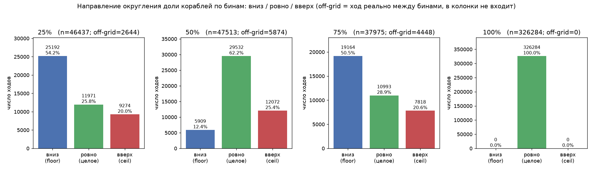
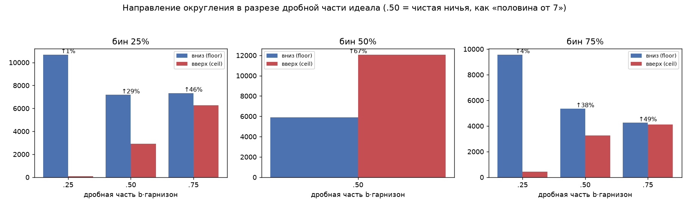

# Направление округления доли кораблей по бинам {25, 50, 75, 100}%

**Дата:** 2026-06-13 · **Источник:** `data/sft.jsonl` (308 264 записи, winner-only) · **Скрипт:** `tools/rounding_analysis.py`

## Вопрос

Доля отправленных кораблей кластеризуется по четвертям (25/50/75/100%), но `доля · гарнизон`
почти никогда не целое (половина от 7 = 3.5 → 3 или 4). В какую сторону эксперты
округляют в каждом бине: вниз (floor) или вверх (ceil)?

## Методика

Для каждого хода `[from_id, angle, ships]`:
- `g` — гарнизон планеты-источника из `obs`, по которому принято решение (поле `ships`, idx 5).
  Датасет уже **исправлен** по сдвигу `obs`↔`moves`, поэтому `g` и `s` синхронны (см. `sft-shipcount-analysis`).
- `s = ships` — сколько реально отправлено; `f = s/g`.
- Привязка к ближайшему бину `b ∈ {0.25, 0.5, 0.75, 1.0}`, идеал `= b·g`.
  - `b·g` целое → **ровно**;
  - `s == floor(b·g)` → **вниз**;
  - `s == ceil(b·g)` → **вверх**;
  - иначе → **off-grid** (ход реально между бинами, в 3 колонки не входит).

Учтено `valid_moves = 471 175`. Выкинуто: `683` мульти-вылета с одной планеты
(неоднозначный гарнизон на ход) + `24 448` с `g ≤ 1` (округлять нечего).

## Результат



| бин | вниз (floor) | ровно | вверх (ceil) | off-grid | **из округлённых: вниз / вверх** |
|----:|----:|----:|----:|----:|:----:|
| 25%  | 25 192 | 11 971 | 9 274  | 2 644 | **73% / 27% → вниз** |
| 50%  | 5 909  | 29 532 | 12 072 | 5 874 | **33% / 67% → вверх** |
| 75%  | 19 164 | 10 993 | 7 818  | 4 448 | **71% / 29% → вниз** |
| 100% | 0      | 326 284 | 0     | 0     | округления нет вообще |

**Главное:**
- **100%** — округления нет никогда: `b·g = g` всегда целое (это ~70% залпов «шлю весь гарнизон»).
- **25% и 75%** — когда дробно, эксперты в ~**71–73% случаев округляют ВНИЗ** (floor).
- **50%** — наоборот, в ~**67% округляют ВВЕРХ** (ceil). «Половина от 7» → чаще **4**, а не 3.

## Нюанс: это НЕ «округление к ближайшему», а floor-смещение



Разрез по дробной части идеала `b·g`:

| бин | frac=.25 (↑вверх) | frac=.50 (↑вверх) | frac=.75 (↑вверх) |
|----:|:----:|:----:|:----:|
| 25% | 0.7% | 28.9% | 46.1% |
| 50% | —    | 67.1% | —    |
| 75% | 4.4% | 37.8% | 49.3% |

- `.25` дробная → ~99% вниз (как и ждём от floor).
- `.75` дробная — при «к ближайшему» должно быть ~100% вверх, а по факту **~46–49% вверх** (почти 50/50,
  лёгкий перекос вниз) → значит **floor**, а не nearest.
- Чистые ничьи `.50`: бины 25%/75% тянут вниз (29% / 38% вверх), а бин 50% тянет вверх (67%).

Устойчивая асимметрия: «половину» чаще берут как `ceil(g/2)` (видимо, чтобы удержать строгое
большинство), а четверти/три-четверти — как `int(f·g)` (floor).

## Оговорка

Реплеи — смесь многих топ-ботов лидерборда, у каждого своя политика. Это эмпирическая
*тенденция* по ансамблю экспертов, а не один детерминированный закон движка.

## Практический вывод для головы числа кораблей

При декоде предсказанного бакета обратно в целое число кораблей разумный дефолт:

```
100% → g
25%  → floor(0.25 · g)
75%  → floor(0.75 · g)
50%  → ceil(0.50 · g)
```

Согласуется с поведением экспертов лучше, чем единый `round`. Эвристику «минимум для захвата»
держать кандидатом на RL-фазу, не как SFT-таргет. См. `sft-shipcount-analysis`, `orbit-wars-sft-replays`.
